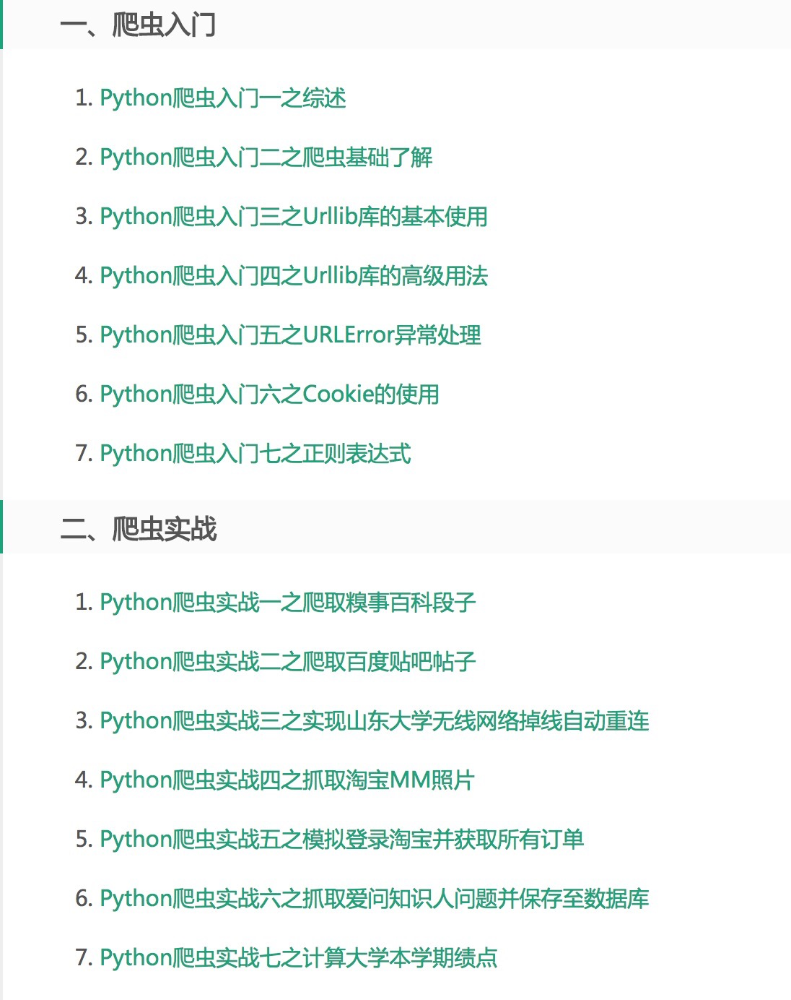
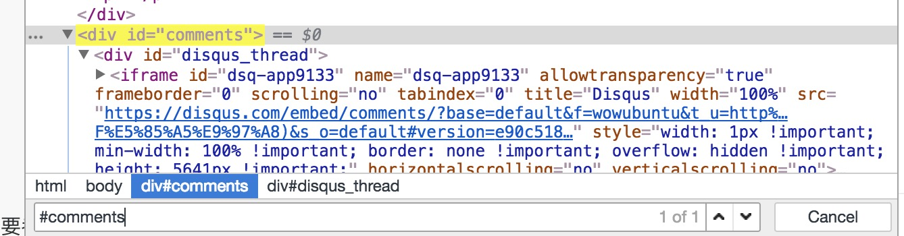

# 关于爬虫最佳实践的一些想法

本文的目的并不在于向读者事无巨细地介绍如何去写各式各样的爬虫.毕竟现在网上这类教程可谓汗牛充栋，随意地搜索即可得到类似下图这样的教程.本文意图通过介绍使用Python(也有一些javascript的内容)进行http请求(以及解析html)的一些方法,和这些方法之间的关系,来说明(作者认为的)Python爬虫的最佳实践是什么样的.它更多的涉及到偏向于设计模式/代码组织等方面的内容.让我们把Python之禅放在本文的开头:

> Beautiful is better than ugly.
>
> Explicit is better than implicit.
>
> Simple is better than complex.
>
> Complex is better than complicated.
>
> Flat is better than nested.
>
> Sparse is better than dense.
>
> Readability counts.
>
> **Special cases aren't special enough to break the rules**.
>
> Although practicality beats purity.
>
> **Errors should never pass silently**.
>
> Unless explicitly silenced.
>
> In the face of ambiguity, refuse the temptation to guess.
>
> **There should be one-- and preferably only one --obvious way to do it**.
>
> Although that way may not be obvious at first unless you're Dutch.
>
> Now is better than never.
>
> Although never is often better than *right* now.
>
> If the implementation is hard to explain, it's a bad idea.
>
> If the implementation is easy to explain, it may be a good idea.
>
> Namespaces are one honking great idea -- let's do more of those!

随意搜索即可得到的爬虫教程目录



## 使用Python进行http请求的方法

这里只会给出最简单的代码示例.详细的使用方法请自行搜寻各模块文档地址.

### 单线程同步阻塞

#### 大概只有初学者写demo会去用的原生方法

```python
from urllib.resposne import urlopen

request = urlopen('http://python.org')
print(request.read())
```

#### 大多数人的选择,简单易用的requests库

```python
import requests

reqeust = requests.get('http://python.org')
print(request.text)
```

### 并发

在这里我想提出的观点是,对于http请求来说,当我们能并发地进行请求时,我们**总是**应当并发地进行请求.

这不只是因为同步的requests写起来实在太无聊了,也不只是因为并发在速度上显而易见的优势.这是因为http本质上来说是无状态的协议,这个请求的发送与上个请求的接收从协议本身来讲是没有任何关系的.而如果使用同步阻塞的代码去实现一系列之间互相没有状态关联的http请求,那么就人为地为这些不同的请求之间建立了不必要的联系,踩到不必要的坑.

即使是像这样表面上看起来没有任何问题的代码示例,在实际生产环境中也遇到了问题.事实上这正是前段时间未经重构的chaos项目经常请求失败的原因.

```python
for url in urls:
    try:
        r = requests.get(url, timeout=10)
    except:
        do_something_if_failed()
    else:
        do_something_with_response(r)
```

这里的代码似乎已经考虑得很周全了,然而它还是卡死了整个程序.原因是requests的timeout参数仅对连接过程有效,与响应体的下载无关.chaos遇到的问题就是服务器常常莫名其妙地迟迟不给客户端回传响应体,导致整个程序卡死.当然这并不是requests库的缺陷,而只是之前我们并不了解这一特性.当时,我只能写了另外的Timeout类临时补上这个漏洞.也许你会说这只是代码没有考虑周全,但我认为,如果我们能使用正确的模式来规避可能的错误,那为什么不呢?

现代的web应用使用session(通常通过cookie来实现)使得http请求有了状态.那么,我们就应当通过无顺序关系的并发来管理没有状态相关的请求,而通过请求之间的顺序来管理有状态相关的请求.在后面的scrapy相关示例里,你会尤为清晰地看到这一点.

#### 多线程

如果你非要使用多线程来进行你的http请求,那么我建议你使用比threading更高级的封装来实现你的请求.

```python
import concurrent.futures

with concurrent.futures.ThreadPoolExecutor(max_workers=20) as executor:
    futures = [executor.submit(requests.get, url) for url in urls]
responses = [f.result() for i in concurrent.futures.as_completed(futures)]
```

顺带一提,不太了解Python GIL的同学可能会不理解,既然GIL使得Python在一个进程内只有一个解释器来执行代码,那为什么我们可以使用多线程来加速IO请求呢.这是因为Python线程会在IO时释放GIL.不仅仅包括网络IO,同时也包括磁盘IO.

如果你想要并发驱动的不只是直接的http请求,同时也包括一些同步的,你无法改写成异步或协程的库,比如使用selenium来驱动浏览器进行爬取,那你也许别无选择(除了更加没什么优势的多进程)只能使用多线程的方法(chaos使用了多进程来驱动Selenium,这是因为主要的性能开销不在并发处理上,Firefox浏览器本身占了很多资源,而且也有现成的任务分发库Celery).

#### 异步和协程

在相当大程度上,Python的多线程是完全可以被异步或者协程取代的,因为GIL的原因导致Python的线程与协程相比毫无性能优势,反而增加debug难度.与javascript相似(作者并无意于考证谁吸收了谁),开始python程序员们使用异步,然后由于对回调的深恶痛绝而拥抱了协程.不过,在良好的组织下,回调也可以相当清晰.

无论是异步还是携程,你都需要一个中央的事件循环来调度整个程序的流程.这个管理器在Twisted里是reactor,在tornado和asyncio里叫IOloop,javascript里打包自带.它们可以大致地理解为差不多的东西.运行你的异步/协程程序时别忘了开始(关闭)你的事件循环.

##### 回调

Twisted是Python异步框架的代表作.尽管它历史悠久,常被人诟病庞大臃肿,但是绝对是非常值得学习的框架.让我们看一段典型的使用基于Twisted的异步回调机制进行http请求的代码.

```python
 from treq import get

 def done(response):
    print(response.code)

get('http://python.org').addCallback(done)
```

其实这就相当于javascript中

```javascript
const xhr = new XMLHttpRequest()
xhr.onreadystatechange = () => {
    if (xhr.readyState === 4 && xhr.status === 200) {
        callback(xhr.responseText)
    }
}
xhr.open('get', 'http://python.org')
xhr.send()
```

事实上作为爬虫工程师,最常遇到Twisted的情况是在使用基于Twisted的爬虫框架scrapy时.让我们看看大名鼎鼎的scrapy代码示例(仅spider部分).

```python
from scrapy import Spider, Request, FormRequest

class DemoSpider(Spider):
    def start_requests(self):
        for url in urls:
            yield Request(url, callback=self.parse)

    def parse(self, response):
        data = do_sth_with_response(response)
        yield FormRequest(some_url, data=data, callback=self.parse_item)

    def parse_item(self, response):
        yield dict(foo=response.css('#bar').extract_first())
```

请注意这里,有状态相关的请求之间是如何通过回调链关联在了一起,而无状态相关的请求之间是怎样并发的.

scrapy是非常非常成熟的,值得学习的框架,它有很多轮子,可以满足包括分布式,js渲染在内的很多需求.在了解scrapy和twisted相关的知识后你也可以方便地写出自己需要的middleware和pipeline进行功能化的定制.

##### 协程

相比回调,协程避免了层层嵌套的"callback hell"(虽然我并不对嵌套感到困扰),还保留了函数的上下文(私以为更重要的特性)

##### tornado

工作中看到大家已经熟练地运用tornado.httpclient来进行协程方法的http请求了,这里的示例就略过了.

##### asyncio/aiohttp

这里是aiohttp官方文档的示例.

```python
import aiohttp
import asyncio
import async_timeout

async def fetch(session, url):
    with async_timeout.timeout(10):
        async with session.get(url) as response:
            return await response.text()

async def main():
    async with aiohttp.ClientSession() as session:
        html = await fetch(session, 'http://python.org')
        print(html)

loop = asyncio.get_event_loop()
loop.run_until_complete(main())
```

这也与这样的javascript代码原理差不多.

```javascript
const fetch = () => new Promise((resolve) => {
    const xhr = new XMLHttpRequest()
    const form = new FormData()
    xhr.onreadystatechange = () => {
    	if (xhr.readyState === 4 && xhr.status === 200) {
        	resolve(xhr.responseText)
    	}
    }
    xhr.open('get', 'http://python.org')
    xhr.send()
})

async function log_response(){
    console.log(await fetch())
}

log_response()
```

这里是一段chaos生产环境下使用asyncio和aiohttp的代码.这里的代码是为了在登录后获取账号的信息,包括发布地点/部门等等.同样请注意无关联的请求是如何通过asyncio.gather并发的.

```python
    @exception_wrapper('获取信息失败')
    def preset(self, request):
        loop = asyncio.get_event_loop()
        data = loop.run_until_complete(self._get_preset_info())
        return dict(status=0, message=json.dumps(['获取信息成功']), data=data)

    async def _get_preset_info(self):
        headers = self._convert_driver_cookies_to_headers()
        data = {}
        async with aiohttp.ClientSession(headers=headers) as session:
            results = await asyncio.gather(
                self._get_companies(session),
                self._get_addresses(session),
                self._get_cities(session))
        for result in results:
            data.update(result)
        return data

    async def _get_companies(self, session):
        async with session.get('http://ehire.51job.com/Systems/OrgList.aspx', proxy=self.http_proxy) as resp:
            sel = Selector(text=await resp.text())
            return dict(companies=sel.css('.table_in td:nth-child(3)>a::text').extract() or
                                  sel.css('#txtCName::attr(value)').extract())

    async def _get_addresses(self, session):
        first_page = await self._get_nth_address_page(session, 1)
        total_page = first_page['totalPage']
        result = dict(addresses=first_page['data'])
        for page in await asyncio.gather(*[self._get_nth_address_page(session, i) for i in range(2, total_page + 1)]):
            result['addresses'].extend(page['data'])
        return result

    async def _get_nth_address_page(self, session, n):
        async with session.post(
                'https://ehire.51job.com/ajax/Systems/GlobalCompanyAjax.aspx',
                data=dict(doType='getworkaddressforjobedit', city='', district='', page=n),
                proxy=self.http_proxy) as resp:
            sel = Selector(text=await resp.text())
            return dict(
                totalPage=int(sel.css('div:last-child span:nth-last-child(2)::text').extract_first()),
                data=[
                    dict(city=div.xpath('./label/text()').extract_first(),
                         address=div.xpath('./label/span/text()').extract_first(),
                         value=div.xpath('./input/@value').extract_first(),
                         code=div.xpath('./input/@code').extract_first())
                    for div in sel.xpath('//*[input]')
                ]
            )

    async def _get_cities(self, session):
        async with session.get('http://ehire.51job.com/CommonPage/JobsPostNumbList.aspx',
                               proxy=self.http_proxy) as resp:
            sel = Selector(text=await resp.text())
            return dict(cities=[dict(
                jobType=tr.css('td:nth-child(1)::text').extract_first(),
                area=tr.css('td:nth-child(2)::text').extract_first(),
                expiryDate=tr.css('td:nth-child(3)::text').extract_first(),
                amount=tr.css('td:nth-child(4)::text').extract_first(),
            ) for tr in sel.css('tr.text')])
```

##### gevent/grequest

由于某个版本以后gevent不再支持patch httplib,所以需要使用其他的封装来使用gevent来并行驱动你的http请求.

```python
import grequests
rs = (grequests.get(u) for u in urls)
```

gevent常被用来做驱动Flask的方法.如果有需要还是值得学习一下的.

##### 协程方法总结

与异步方法在回调处的断点相似,协程总是需要在需要等待的地方显式地把控制权交还给事件循环.tornado用`yield`(twisted后来也增加了对`yield`协程的支持),asyncio使用`await`/`yield` from,gevent可以是`gevent.sleep(0)`(grequest封装了起来).在我看来这正是协程相对于线程的优势之一:对程序流程更高的控制力.毕竟我们常常并不知道Python会在何时切换线程,何时释放GIL.但对于协程而言我们总可以知道何时控制权在运行我们的代码,何时控制权又被交还给了事件循环.

### 基于浏览器的方法

当遇到大量js渲染的内容又~~懒得找~~找不到/破解不了来源的js时,我们通常用浏览器搞定.

#### selenium

selenium是一套自动测试的框架.我们将它用于爬虫,主要是希望使用它模拟一些复杂的用户行为.比如使用它登录以后获取cookie,然后使用cookie进行http的交互等等.

如果说使用直接请求http协议的方法还要求那么一点http协议网络基础相关的知识的话,使用selenium几乎只要求你会在日常生活中使用浏览器,然后将用户行为翻译成selenium语句就可以了.

```python
from selenium.webdriver import Firefox

f = Firefox()
f.get('http://python.org')
print(f.page_source)
```

唯一值得一提的是在遇到iframe元素时,你需要显式的切换到目标所在的frame(之后有需要的话再切回去),这是我看到最多的关于selenium的提问了.

```python
driver.switch_to.frame(self.driver.find_element_by_css_selector('#myiframe1'))
```

#### chrome extension

如果你需要更高效的基于浏览器的爬取方法,推荐使用chrome extension来进行爬取.你可以通过更复杂的iframe等等实现单个浏览器页面的并发,但是下面的代码通常应该完全够用了.

[background.js]

```javascript
function getPageSource(tab) {
  return new Promise((resolve) => {
    chrome.tabs.executeScript(tab.id, {file: 'getPageSource.js'}, (response) => {
      resolve(new DOMParser().parseFromString(response[0], 'text/html'))
    })
  })
}

function fetchUrl(url) {
  return new Promise((resolve) => {
    chrome.tabs.create({url}, async (tab) => {
      resolve(await getPageSource(tab))
      chrome.tabs.remove(tab.id)
    })
  })
}
```

[getPageSource.js]

```javascript
(() => document.all[0].outerHTML)()
```

## 使用python解析html

### 正则表达式

请不要,不要,不要使用正则表达式来解析html.详情请见[Stack Overflow](https://stackoverflow.com/questions/1732348/regex-match-open-tags-except-xhtml-self-contained-tags).这里指的不要用正则表达式,指的是不要用正则表达式解析html的结构,而不是在进行文本处理时也不要使用正则.除了回答里提到的从理论上的context-free grammar和regular grammar的区别以外,在实践中,当为了匹配html标签使用大量通配符时,在大规模抓取时正则表达式会造成严重的性能问题.学过编译原理的同学应该比我理解透彻得多.

### beautifulsoup/xpath/css选择器

beautifulsoup是个很流行的html解析库.初学时我也用过它.确实使用它来写代码非常pythonic.但它毕竟只是lxml(或者其他解析库的封装).它的功能比xpath只少不多.此外,从作为日常调试的工具上来说,beautifulsoup写起来比xpath/css选择器麻烦得多.如果你使用xpath/css选择器,你可以很方便的在chrome开发者工具里测试你提取的部分是否正确.这比每次运行一次python脚本快多了.毕竟省下时间才能更好地~~摸鱼~~提升自己.



此外,直接使用xpath/css选择器也比较方便进行跨语言的兼容.如chaos同时维护的python服务端和chrome插件辅助工具里,有解析同样结构的html部分.

python

```python
self._open_page('https://lpt.liepin.com/ejob/editejob4public/')
departments = [li.get_attribute('title') for li in self.driver.find_elements_by_css_selector('.department li[data-value]')]
```

javascript

```javascript
{
  url: 'https://lpt.liepin.com/ejob/editejob4public/',
  parser: document => [...document.querySelectorAll('.department li[data-value]')].map(li => li.getAttribute('title')),
  name: 'departments',
}
```

## 怎样组织爬虫代码

### 爬虫结构

事实上,从上面两个子标题已经可以看出(或者有基本抽象能力的同学总能自己领会到),爬虫代码无非是可以抽象为发送请求和抽取数据两部分(加上处理/存储数据三部分).scrapy的写法使你很清晰地体会到这一点.让我们回顾一下scrapy的示例代码.

```python
from scrapy import Spider, Request, FormRequest

class DemoSpider(Spider):
    def start_requests(self):
        for url in urls:
            yield Request(url, callback=self.parse)

    def parse(self, response):
        data = do_sth_with_response(response)
        yield FormRequest(some_url, data=data, callback=self.parse_item)

    def parse_item(self, response):
        yield dict(foo=response.css('#bar').extract_first())
```

可以看到,回调链中函数yield的结果,一定要么是个request,要么是data.(数据处理部分scrapy抽象为data pipeline处理)

那么,同样,一个更general的爬虫程序的主要函数,也一定可以写成在request和data处返回的形式.不妨将你的爬虫改造试试.

### 解析提取数据的写法

我们总是应当尽量通过建立数据与数据之间,数据与html结构树之间的映射关系来完成数据的提取.通过声明式的方法来获取数据,而不是命令式的方法在数据集上做删改.给出一段简历解析的示例.

html页面

<td colspan="3" style="line-height: 22px;font-size: 12px;">
    <table width="100%" border="0" cellspacing="0" cellpadding="0">
        <tbody>
        <tr>
            <td width="18%" class="bluecolor"
                style="line-height: 22px;font-size: 12px;color: #1e62b3;text-align: right;padding-right: 7px;">
                姓　　名：
            </td>
            <td width="28%" style="line-height: 22px;font-size: 12px;">
                潘玲玲
            </td>
            <td width="13%" class="bluecolor"
                style="line-height: 22px;font-size: 12px;color: #1e62b3;text-align: right;padding-right: 7px;">
                性　　别 ：
            </td>
            <td width="24%" style="line-height: 22px;font-size: 12px;">
                女
            </td>
        </tr>
        <tr>
            <td class="bluecolor"
                style="line-height: 22px;font-size: 12px;color: #1e62b3;text-align: right;padding-right: 7px;">
                出生日期 ：
            </td>
            <td style="line-height: 22px;font-size: 12px;">
                1995-05-16
            </td>
            <td class="bluecolor"
                style="line-height: 22px;font-size: 12px;color: #1e62b3;text-align: right;padding-right: 7px;">
                教育程度 ：
            </td>
            <td style="line-height: 22px;font-size: 12px;">
                本科
            </td>
        </tr>
        <tr>
            <td class="bluecolor"
                style="line-height: 22px;font-size: 12px;color: #1e62b3;text-align: right;padding-right: 7px;">
                现居住地 ：
            </td>
            <td style="line-height: 22px;font-size: 12px;">
                上海
            </td>
            <td class="bluecolor"
                style="line-height: 22px;font-size: 12px;color: #1e62b3;text-align: right;padding-right: 7px;">
                户籍　地 ：
            </td>
            <td style="line-height: 22px;font-size: 12px;">
                江苏 盐城
            </td>
        </tr>
        <tr>
            <td class="bluecolor"
                style="line-height: 22px;font-size: 12px;color: #1e62b3;text-align: right;padding-right: 7px;">
                毕业时间 ：
            </td>
            <td style="line-height: 22px;font-size: 12px;">
                2021-01-01
            </td>
            <td class="bluecolor"
                style="line-height: 22px;font-size: 12px;color: #1e62b3;text-align: right;padding-right: 7px;">
                证件号码 ：
            </td>
            <td style="line-height: 22px;font-size: 12px;">
                身份证 (
                3209211995 ****)
            </td>
        </tr>
        <tr>
            <td class="bluecolor"
                style="line-height: 22px;font-size: 12px;color: #1e62b3;text-align: right;padding-right: 7px;">
                婚姻状况 ：
            </td>
            <td style="line-height: 22px;font-size: 12px;">
                保密
            </td>
            <td class="bluecolor"
                style="line-height: 22px;font-size: 12px;color: #1e62b3;text-align: right;padding-right: 7px;">
                政治面貌 ：
            </td>
            <td style="line-height: 22px;font-size: 12px;">
                党员
            </td>
        </tr>
        <tr>
            <td class="bluecolor"
                style="line-height: 22px;font-size: 12px;color: #1e62b3;text-align: right;padding-right: 7px;">
                国　　籍 ：
            </td>
            <td style="line-height: 22px;font-size: 12px;">
                中国
            </td>
            <td class="bluecolor"
                style="line-height: 22px;font-size: 12px;color: #1e62b3;text-align: right;padding-right: 7px;">
                民　　族 ：
            </td>
            <td style="line-height: 22px;font-size: 12px;">
                汉族
            </td>
        </tr>
        <tr>
            <td class="bluecolor"
                style="line-height: 22px;font-size: 12px;color: #1e62b3;text-align: right;padding-right: 7px;">
                身　　高 ：
            </td>
            <td>
                167 cm
            </td>
            <td class="bluecolor"
                style="line-height: 22px;font-size: 12px;color: #1e62b3;text-align: right;padding-right: 7px;">
                体　　重 ：
            </td>
            <td style="line-height: 22px;font-size: 12px;">
                123kg
            </td>
        </tr>
        <tr>
            <td class="bluecolor"
                style="line-height: 22px;font-size: 12px;color: #1e62b3;text-align: right;padding-right: 7px;">
                年　　龄 ：
            </td>
            <td colspan="3" style="line-height: 22px;font-size: 12px;">
                22 岁
            </td>
        </tr>
        </tbody>
    </table>
</td>

test.html
```html
<td colspan="3" style="line-height: 22px;font-size: 12px;">
    <table width="100%" border="0" cellspacing="0" cellpadding="0">
        <tbody>
        <tr>
            <td width="18%" class="bluecolor"
                style="line-height: 22px;font-size: 12px;color: #1e62b3;text-align: right;padding-right: 7px;">
                姓　　名：
            </td>
            <td width="28%" style="line-height: 22px;font-size: 12px;">
                潘玲玲
            </td>
            <td width="13%" class="bluecolor"
                style="line-height: 22px;font-size: 12px;color: #1e62b3;text-align: right;padding-right: 7px;">
                性　　别 ：
            </td>
            <td width="24%" style="line-height: 22px;font-size: 12px;">
                女
            </td>
            <td width="17%" rowspan="9" style="line-height: 22px;font-size: 12px;">
                
            </td>
        </tr>
        <tr>
            <td class="bluecolor"
                style="line-height: 22px;font-size: 12px;color: #1e62b3;text-align: right;padding-right: 7px;">
                出生日期 ：
            </td>
            <td style="line-height: 22px;font-size: 12px;">
                1995-05-16
            </td>
            <td class="bluecolor"
                style="line-height: 22px;font-size: 12px;color: #1e62b3;text-align: right;padding-right: 7px;">
                教育程度 ：
            </td>
            <td style="line-height: 22px;font-size: 12px;">
                本科
            </td>
        </tr>
        <tr>
            <td class="bluecolor"
                style="line-height: 22px;font-size: 12px;color: #1e62b3;text-align: right;padding-right: 7px;">
                现居住地 ：
            </td>
            <td style="line-height: 22px;font-size: 12px;">
                上海
            </td>
            <td class="bluecolor"
                style="line-height: 22px;font-size: 12px;color: #1e62b3;text-align: right;padding-right: 7px;">
                户籍　地 ：
            </td>
            <td style="line-height: 22px;font-size: 12px;">
                江苏 盐城
            </td>
        </tr>
        <tr>
            <td class="bluecolor"
                style="line-height: 22px;font-size: 12px;color: #1e62b3;text-align: right;padding-right: 7px;">
                毕业时间 ：
            </td>
            <td style="line-height: 22px;font-size: 12px;">
                2021-01-01
            </td>
            <td class="bluecolor"
                style="line-height: 22px;font-size: 12px;color: #1e62b3;text-align: right;padding-right: 7px;">
                证件号码 ：
            </td>
            <td style="line-height: 22px;font-size: 12px;">
                身份证 (
                3209211995 ****)
            </td>
        </tr>
        <tr>
            <td class="bluecolor"
                style="line-height: 22px;font-size: 12px;color: #1e62b3;text-align: right;padding-right: 7px;">
                婚姻状况 ：
            </td>
            <td style="line-height: 22px;font-size: 12px;">
                保密
            </td>
            <td class="bluecolor"
                style="line-height: 22px;font-size: 12px;color: #1e62b3;text-align: right;padding-right: 7px;">
                政治面貌 ：
            </td>
            <td style="line-height: 22px;font-size: 12px;">
                党员
            </td>
        </tr>
        <tr>
            <td class="bluecolor"
                style="line-height: 22px;font-size: 12px;color: #1e62b3;text-align: right;padding-right: 7px;">
                国　　籍 ：
            </td>
            <td style="line-height: 22px;font-size: 12px;">
                中国
            </td>
            <td class="bluecolor"
                style="line-height: 22px;font-size: 12px;color: #1e62b3;text-align: right;padding-right: 7px;">
                民　　族 ：
            </td>
            <td style="line-height: 22px;font-size: 12px;">
                汉族
            </td>
        </tr>
        <tr>
            <td class="bluecolor"
                style="line-height: 22px;font-size: 12px;color: #1e62b3;text-align: right;padding-right: 7px;">
                身　　高 ：
            </td>
            <td>
                167 cm
            </td>
            <td class="bluecolor"
                style="line-height: 22px;font-size: 12px;color: #1e62b3;text-align: right;padding-right: 7px;">
                体　　重 ：
            </td>
            <td style="line-height: 22px;font-size: 12px;">
                123kg
            </td>
        </tr>
        <tr>
            <td class="bluecolor"
                style="line-height: 22px;font-size: 12px;color: #1e62b3;text-align: right;padding-right: 7px;">
                年　　龄 ：
            </td>
            <td colspan="3" style="line-height: 22px;font-size: 12px;">
                22 岁
            </td>
        </tr>
        </tbody>
    </table>
</td>
```

```python
from scrapy.selector import Selector


def parse_html(html):
    selector = Selector(text=html)
    name_label = {
        'name': '姓名',
        'sex': '性别',
        'height': '身高',
        'weight': '体重',
        'age': '年龄',
    }

    def extract_data(label):
        return selector.xpath(
            '//td[re:test(text(),"%s")]/following-sibling::*[1]/text()' % '\s*'.join(label)).extract_first().strip()

    def reprocess_data(name):
        extract_digit = lambda x: re.findall('\d+', x)[0]
        precess_function = {
            'height': extract_digit,
            'age': extract_digit,
            'weight': extract_digit
        }
        return precess_function.get(name, lambda x: x)

    return {name: reprocess_data(name)(extract_data(label)) for name, label in name_label.items()}


data = parse_html(open('test.html', encoding='utf-8').read())
print(data)
```

可以看到这里有3个映射,一是从我们需要的key名到html标签名的映射,二是从html标签名到raw data的映射,3是从raw data到processed data的映射.最终我们通过一行简单的声明语句将提取后的数据返回

### 吐槽下前同事的代码

让我们看看两个selenium代码示例.请读者自行评判.这里实现的是设置猎聘简历回流功能.

重构之前

```python
 def set_email_feedback(self, driver, email_feedback):
        driver.execute_script("window.scrollTo(document.body.scrollWidth* 0.5, document.body.scrollHeight * 1)")
        feedback_box = driver.find_elements_by_class_name('editjob-item')[2]
        feedback_email_divs = feedback_box.find_element_by_tag_name('div')
        items = feedback_email_divs.find_element_by_css_selector('.email-list').find_elements_by_tag_name('em')

        def get_email_list(email_to):
            action_get_email_list = ActionChains(driver=driver)
            action_get_email_list.move_to_element(email_to)
            action_get_email_list.click()
            action_get_email_list.perform()
            email_list_divs = driver.find_element_by_css_selector('.dl-list')
            emails = email_list_divs.find_elements_by_tag_name('li')
            return emails

        def set_single_feedback_email(element):
            try:
                email_list = get_email_list(element)
                email_choose = None
                for email in email_list:
                    address = email.find_elements_by_tag_name('input')[1].get_attribute('value')
                    if address == email_feedback:
                        email_choose = email.find_elements_by_tag_name('input')[0]
                        break
                time.sleep(1)
                if email_choose:
                    email_choose.click()
                    time.sleep(1)
                else:
                    add_email = driver.find_element_by_css_selector('span.float-right')
                    action = ActionChains(driver=driver)
                    action.move_to_element(add_email)
                    action.click()
                    action.perform()
                    wait = ui.WebDriverWait(driver=driver, timeout=10)
                    wait.until(EC.element_to_be_clickable((By.CSS_SELECTOR, '.dl-list')))
                    email_list_div = driver.find_element_by_css_selector('.dl-list')
                    add_email = email_list_div.find_elements_by_tag_name('dd')[2]
                    add_email_enter = add_email.find_element_by_tag_name('input')
                    action = ActionChains(driver=driver)
                    action.move_to_element(add_email_enter)
                    action.click()
                    action.send_keys(email_feedback)
                    action.perform()
                    time.sleep(1)
                    add_email_button = add_email.find_element_by_class_name('editor-mail').find_element_by_class_name('float-right').find_element_by_tag_name('input')
                    action = ActionChains(driver=driver)
                    action.move_to_element(add_email_button)
                    action.click()
                    action.perform()
                    time.sleep(5)
                    email_list = get_email_list(element)
                    email_choose = None
                    for email in email_list:
                        address = email.find_elements_by_tag_name('input')[1].get_attribute('value')
                        if address == email_feedback:
                            email_choose = email.find_elements_by_tag_name('input')[0]
                            break
                    if email_choose:
                        driver.execute_script("arguments[0].scrollIntoView(true);", email_choose)
                        email_choose.click()
                        time.sleep(1)
                    else:
                        raise break_exception(message='failed to choose email', signal=traceback.format_exc())
            except:
                raise break_exception(message='failed to choose email', signal=traceback.format_exc())
            # submit
            try:
                dialog_bottom = driver.find_element_by_css_selector('.dialog-bottom')
                submit_button = dialog_bottom.find_element_by_tag_name('input')
                action = ActionChains(driver=driver)
                action.move_to_element(submit_button)
                action.click()
                action.perform()
                time.sleep(1)
            except:
                raise break_exception(message='failed to submit email choose', signal=traceback.format_exc())

        for each in items:
            set_single_feedback_email(each)
```

重构之后

```python
    @exception_wrapper('设置简历邮箱出错')
    @retry(stop_max_attempt_number=3)
    def _set_email_feedback(self, email):
        driver = self.driver

        def prepare_popup():
            email_element = driver.find_element_by_xpath('//*[contains(@data-name,"mail")]/em')
            self._scroll_to_element(email_element, True)
            self.wait.until(lambda driver: email_element.is_enabled())
            email_element.click()
            self.wait.until(EC.element_to_be_clickable((By.CSS_SELECTOR, '.vdialog .vd-close')))

        def get_email_list():
            elements = driver.find_elements_by_css_selector('li>[data-selector="email-addr"]')
            email_list = [element.get_attribute('value') for element in elements]
            return email_list

        def add_email(email):
            driver.find_element_by_css_selector('.dd-2>span').click()
            self._slowly_enter_text_into_element(
                driver.find_element_by_css_selector('.editor-mail>[data-selector="email-addr"]'), email)
            self.driver.find_element_by_css_selector('.editor-mail [data-type="modify"]').click()
            time.sleep(2)

        def select_email(email):
            checkbox = driver.find_element_by_xpath('//li[./input[@value=\'%s\']]/input[@type=\'checkbox\']' % email)
            if not checkbox.get_attribute('checked'):
                self._scroll_to_element(checkbox)
                checkbox.click()
            self.wait.until(EC.element_to_be_clickable((By.CSS_SELECTOR, '.dialog-bottom .submit'))).click()

        def check_success(email):
            if not driver.find_elements_by_css_selector('[data-id="%s"]' % email):
                raise ServerException('简历邮箱设置失败')

        prepare_popup()
        if email not in get_email_list():
            add_email(email)
        select_email(email)
        check_success(email)
```
